# Lux Fitness Gym

> **Tagline:** A responsive gym timetable & class booking experience built with Django & Bootstrap, deployed on Heroku for educational purpose only.

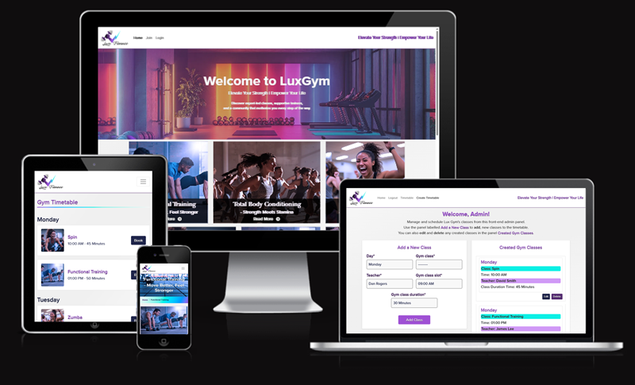

**Live Site Link 🚀:** [Lux Fitness Gym](https://fitness-gym-lux-9e794b641127.herokuapp.com/)

**Repository Link 🐙:** [Fitness Lux Gym](https://github.com/SamAtkinsonModeste/fitness-lux-gym)

---

## 📚 Table of Contents

<details>
  <summary><strong><span style="font-size: 1.05em;">👈 Click to expand the table of contents</span></strong></summary>

- [📌 Overview](#-overview)
- [📈 Agile Delivery](#-agile-delivery)
- [🧭 User Experience (UX)](#-user-experience-ux)

  - [🎯 Strategy & Goals](#-strategy--goals)
  - [🧩 Scope & User Stories](#-scope--user-stories)
  - [🗺️ Information Architecture & Schema](#-information-architecture--schema)
  - [🧱 Wireframes](#-wireframes)
  - [🎨 UI Design](#-ui-design)

- [✨ Features](#-features)

  - [🛤️ Key Journeys](#-key-journeys)
  - [🧩 Existing Features](#-existing-features)
  - [🔮 Future Enhancements](#-future-enhancements)

- [♿ Accessibility](#-accessibility)
- [🚀 Performance](#-performance)
- [🔐 Security](#-security)
- [🛠️ Technologies](#-technologies)
- [💻 Local Development](#-local-development)
- [🧪 Testing](#-testing)
- [🐞 Bugs & Fixes](#-bugs--fixes)
- [🚢 Deployment](#-deployment)

  - [☁️ Heroku Deployment](#-heroku-deployment)
  - [🍴 Forking & Cloning](#-forking--cloning)

- [🙏 Credits](#-credits)
- [🏅 Acknowledgements](#-acknowledgements)

</details>

---

## 📌 Overview

Lux Fitness Gym is a mobile‑first Django application that showcases a curated set of **gym classes** and a weekly **timetable**. It demonstrates:

- A clean **Bootstrap** UI integrated into Django templates
- CRUD for scheduled gym classes (admin) and read/browse for visitors
- Protected Frontend Admin Dashboard for staff to create, edit, and delete classes and timetable entries (no day‑to‑day use of Django Admin)
- Friendly UX patterns (alerts and breadcrumbs)
- A production deployment on **Heroku** with static files served via WhiteNoise
- Professional **Git/GitHub** workflow with Conventional Commits

**Why this project is useful**

- Mimics a real‑world gym website (clear classes, teachers, session times)
- Demonstrates Django best practices (models, views, templates, messages, forms)
- Applies **Agile** ways of working with epics, user stories, and MoSCoW prioritisation

[Back to top ⬆️](#-lux-fitness-gym)

---

## 📈 Agile Delivery

- **📋 Project Board (Agile / Backlog)** [Lux Fitness Project Board](https://github.com/users/SamAtkinsonModeste/projects/18/views/1)

- **Issues:** <!-- GitHub Issues URL -->
- Used **GitHub Projects** Kanban (Backlog → In Progress → Review → Done)
- Stories include **Acceptance Criteria**, **Definition of Done**, and **labels** (theme, epic, MoSCoW).
- **MoSCoW** priorities guided scope: Must‑have CRUD for classes & timetable, Should‑have filters/search, Could‑have extras (e.g., teacher bios), Won’t‑have (e.g., password reset) for this iteration.

<details>
<summary>Example Epics</summary>

- **Timetable & Scheduling (Epic):** Create and list scheduled classes; admin can seed/edit/delete.
- **Gym Classes (Epic):** Curated set of well‑known classes (e.g., Yoga, Pilates, Spin, HIIT, Zumba) with images and excerpts.
- **UX & Navigation (Epic):** Navbar, breadcrumbs, alerts, and responsive layouts.

</details>

<details>
<summary>Sample User Stories</summary>

**Visitor**

- As a visitor, I can browse gym classes so I can decide which one to attend.
- As a visitor, I can view the weekly timetable so I can see what’s on and when.

**Admin**

- As an admin, I can create/update/delete a scheduled class so the timetable stays accurate.

</details>

[Back to top ⬆️](#-lux-fitness-gym)

## 🧭 User Experience (UX)

### 🎯 Strategy & Goals

- Communicate clearly what the gym offers (classes, teachers, schedule)
- Reduce friction to find a class by **day**, **type**, or **teacher**
- Keep the interface readable and responsive on phones first

### 🧩 Scope & User Stories

See **Agile Delivery** section for the labelled Issues and Epics.

### 🗺️ Information Architecture & Schema

The data is intentionally simple for clarity.

**Core Models**

- `FitnessClasses` (from `luxclasses` app)
  Fields: `name`, `name_extension`, `excerpt`, `image`, `content` …

- `ScheduledClass` (from `gymtimetable` app)
  Fields: `day` (choice), `class_type` (FK → `FitnessClasses`), `start_time`, `duration`, `teacher` (choices), timestamps.

> Design Note: We use **choices** for `day` and `teacher` to keep validation simple and admin‑friendly. All models with `created_at` also include `updated_at`.

**Entity Relationship Diagram (ERD)**

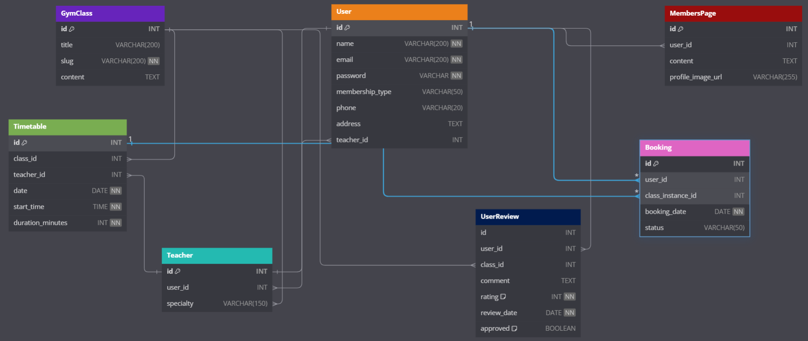

### 🧱 Wireframes

Low‑fidelity sketches were translated into simple Bootstrap layouts. An interactive prototype is available here:

[🔗 Interactive Wireframe - Created in AdobeXD:](https://xd.adobe.com/view/4be8ce91-5c34-4a35-adc9-2736f12b9fbb-1ebb/)

<details>
  <summary><strong>Static fallback wireframe screenshots (click to expand)</strong></summary>

  <p align="center">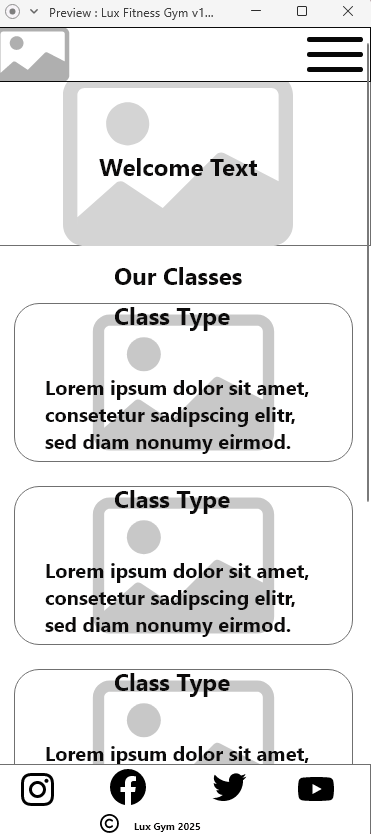</p>
  <p align="center">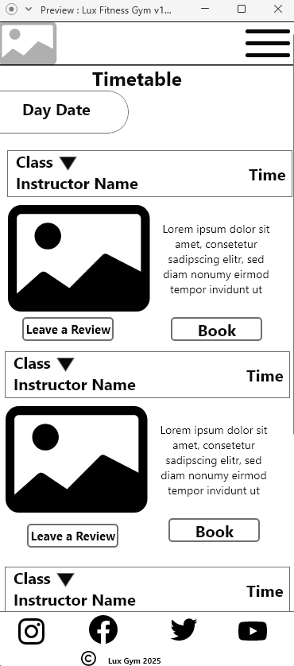</p>
  <p align="center">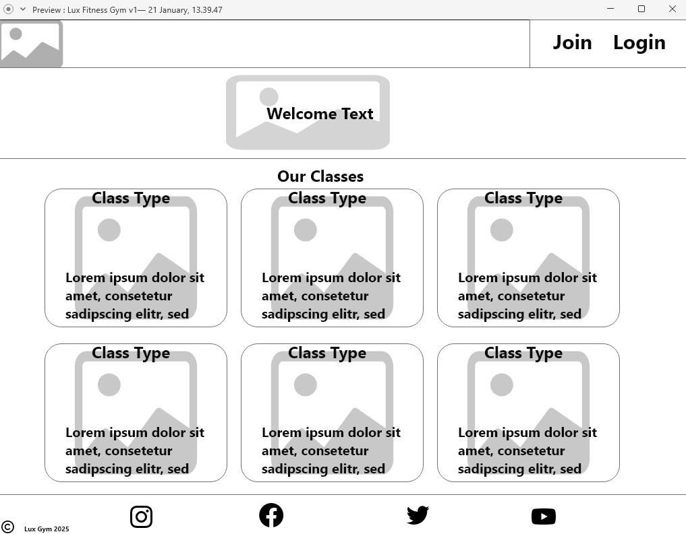</p>
   <p align="center">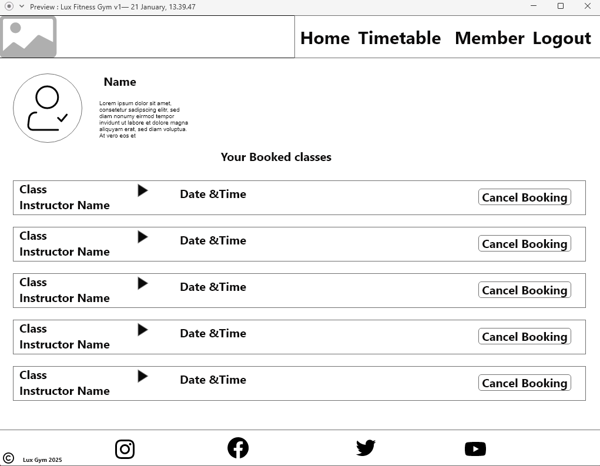</p>
</details>

### 🎨 UI Design

- **Bootstrap 5** utilities for spacing, grid, flex, and typography
- Custom CSS variables (including a gradient) for brand accents
- Accessible color contrast and focus states

[Back to top ⬆️](#-lux-fitness-gym)

## ✨ Features

### 🛤️ Key Journeys

1. **Browse Classes → Class Detail**
   Card grid → image/title/excerpt → details with content and back link.
2. **View Timetable**
   Filter by day; show `start_time`, `duration`, `teacher` with readable labels.

### 🧩 Existing Features

- Responsive **Navbar** with active link styling
- **Breadcrumbs** for orientation
- **Django messages/alerts** for feedback
- **Timetable** list view with filters
- **Class Detail** page with image and rich text content
- **Admin**: manage `FitnessClasses` and `ScheduledClass`

### 🔮 Future Enhancements

- Search & filter by **teacher** or **difficulty**
- “Add to Calendar” (export .ics for a class)
- Simple booking/request form (emails the gym)
- Teacher profile pages with images

### 🖼️ Logo

A clean, responsive **Lux Gym** logo used site-wide:

- Placed in the **navbar** and links to the **Homepage**.
- Delivered via Django **staticfiles** and sized with **Bootstrap utilities** and/or a small CSS rule (e.g., `height: 32px`).
- Includes descriptive `alt` text for screen readers.

<details>
  <summary><strong>Screenshots of Logo (click to expand)</strong></summary>

**Logo in Mobile Navbar**


**Logo in Desktop Navbar**

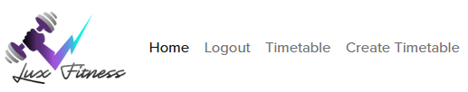

</details>

[Back to top ⬆️](#-lux-fitness-gym)

---

### 🧭 Navbar

Mobile-first, **Bootstrap** navbar with collapse on small screens:

- Links: **Home**, **Logout**, **Timetable**; **Create Timetable** (is visible to staff only).
- Auth-aware: shows **Login / Register** when logged out, **Logout** when logged in (using Django template logic).
- Uses accessible labels, focus outlines, and active-link styling.

<details>
  <summary><strong>Screenshots of Navigation (click to expand)</strong></summary>

**Mobile Navbar**

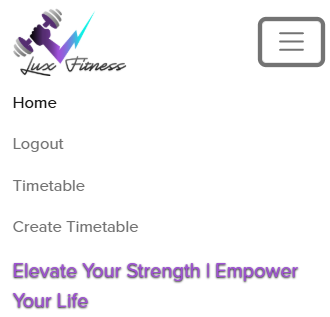

**Desktop Navbar**


</details>

[Back to top ⬆️](#-lux-fitness-gym)

---

### 🔐 Authentication (Register / Login / Logout)

User accounts are handled with Django’s auth views and custom templates styled with **Bootstrap**.

- **Register**: create an account to access member-only features.
- **Login**: authenticate and return to the page you came from (where possible).
- **Logout**: secure sign-out with a confirmation screen and success alert (Django Messages).
- Templates use Django’s `` and Bootstrap form classes for accessible, responsive forms.

<details>
  <summary><strong>Screenshots of Register / Login / Logout (click to expand)</strong></summary>

<br>

**Register**

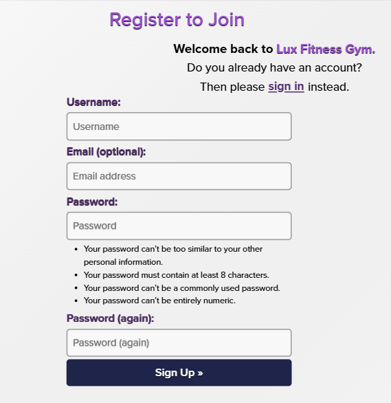

**Login**

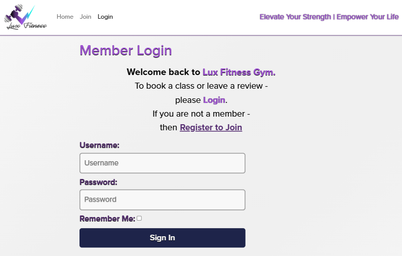

**Logout**

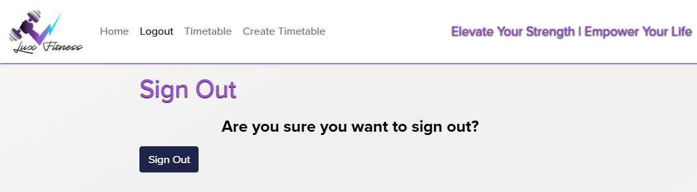

</details>

[Back to top ⬆️](#-lux-fitness-gym)

---

### 🏠 Homepage

A welcoming, **Bootstrap**-based layout that introduces the gym and classes:

- **Hero** section with headline, subheading, and clear CTAs (e.g., _View Classes_, _View Timetable_).
- **Featured classes** grid with images, excerpts, and links to class detail pages.
- Designed mobile-first; images use `alt` text; headings follow a logical outline for accessibility.

<details>
  <summary><strong>Screenshots of Mobile & Desktop Homepage (click to expand)</strong></summary>
<br>

**Mobile Home Page**

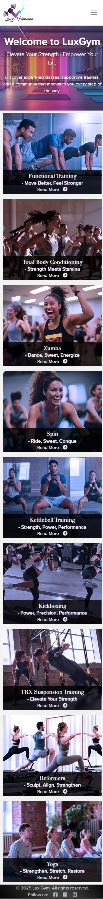

**Desktop Home Page**

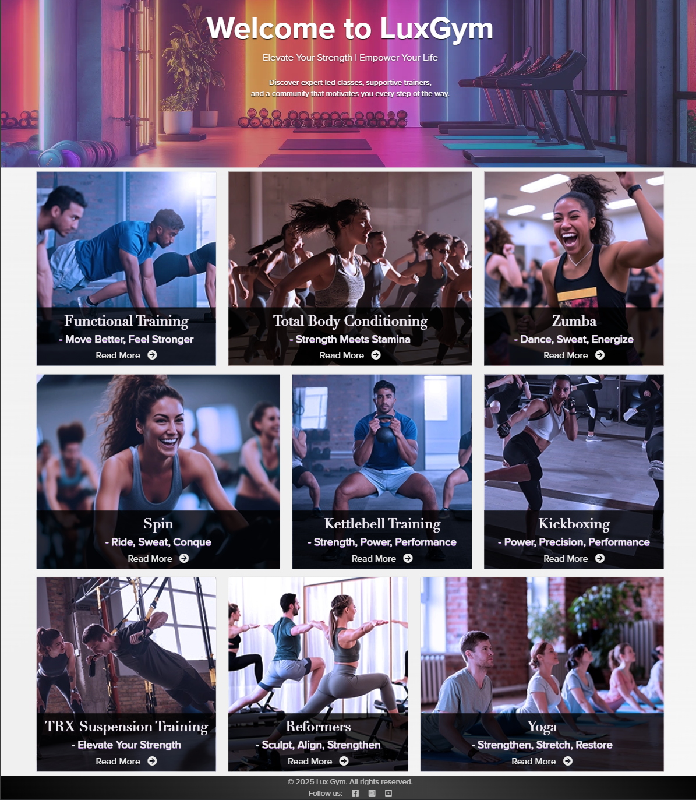

</details>

[Back to top ⬆️](#-lux-fitness-gym)

---

### 📄 Class Detail Page

Detailed view for each **gym class**:

- Large header image, class name + extension, and rich description content.
- **Breadcrumbs** for orientation and a “Back to classes” link for easy navigation.
- Uses semantic HTML; media has descriptive `alt` attributes.

<details>
  <summary><strong>Screenshot of Detail Lux Class Zumba (click to expand)</strong></summary>
<br>

**Any one for a Zumba Class?**

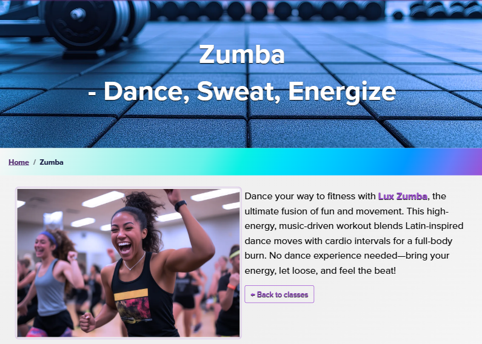

</details>

[Back to top ⬆️](#-lux-fitness-gym)

---

### 🛠️ Admin Dashboard (Frontend)

A protected **frontend** dashboard (no daily reliance on Django Admin):

- **Staff-only** CRUD for **Classes** and **Timetable** entries (create, edit, delete).
- Built with Django views/forms and **Bootstrap**; shows **success/error alerts** via Django Messages.
- Enforced with `login_required` and role checks (e.g., `request.user.is_staff`); CSRF enabled.

<details>
  <summary><strong>Screenshot of Admin Dashboard (click to expand)</strong></summary>
<br>

**View of admin created classes for the timetable**

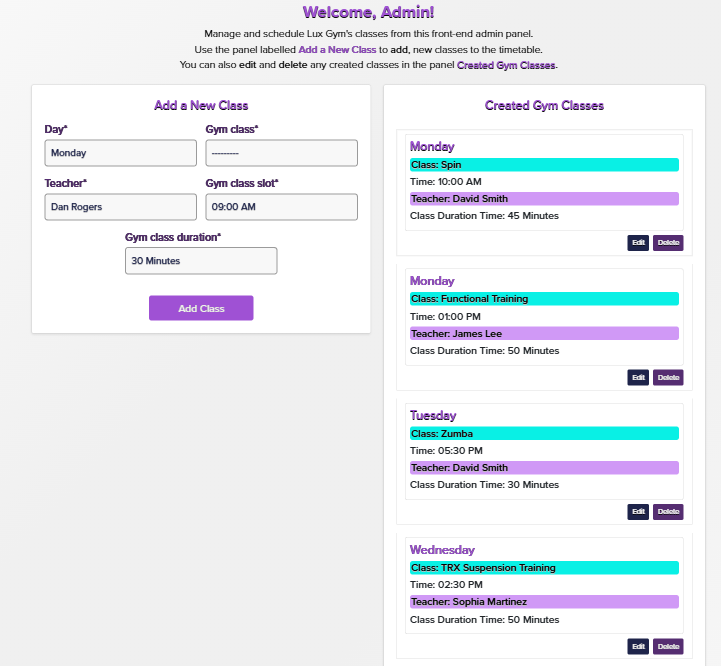

</details>

[Back to top ⬆️](#-lux-fitness-gym)

---

### 🗓️ Timetable (User View)

Clear, readable schedule for visitors:

- Filter by **day**; each entry shows **start time**, **duration**, and **teacher** (readable labels).
- Responsive layout using **Bootstrap grid/flex**; badges/pills for quick scanning if desired.
- Designed for fast scanning on mobile; keyboard accessible.

<details>
  <summary><strong>Screenshots (click to expand)</strong></summary>

  <br>
**Lux Fitness Timetable**

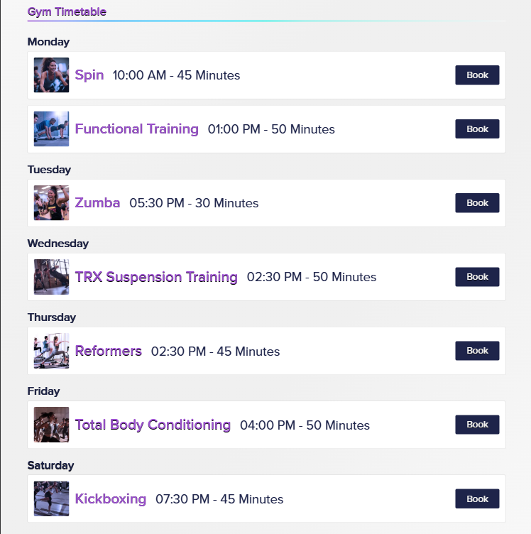

</details>

[Back to top ⬆️](#-lux-fitness-gym)

---

### 🦶 Footer

Consistent footer with social media links:

- **Social Media** links with the use of Font Awesome.
- Opens external links safely; includes a simple **© Lux Gym** notice.
- Reused across pages for consistent navigation and branding.

<details>
  <summary><strong>Screenshot of Footer (click to expand)</strong></summary>
<br>

**Footer with social media links**


</details>

[Back to top ⬆️](#-lux-fitness-gym)

---

### 🔔 Alerts & User Feedback

The site uses **Django’s messages framework** with **custom-styled Bootstrap alerts** to provide clear, timely feedback. Alerts are dismissible, consistent across pages, and accessible (using appropriate ARIA roles).

**When users see alerts**

- **Class added / updated / removed** → success messages confirm the action.
- **Logged in** → info message (e.g., “You’re logged in as <username>”).
- **Logged out** → success message confirming sign-out.
- **Form errors / validation issues** → shown inline near fields; a top-level danger/warning alert may also appear when appropriate.

**Styling & behavior**

- Mapped to Bootstrap variants (e.g., success & danger) with a custom palette to match Lux Gym branding.
- **Dismissible** (`×` close button) and positioned near the top of the main content for visibility.
- Uses ARIA roles (`role="alert"`/`aria-live="assertive"` where appropriate) for screen readers.
- Messages persist for a single request/redirect and then clear, avoiding stale notices.

<details>
  <summary><strong>Screenshots of Alerts (click to expand)</strong></summary>

**Class added (success)**


**Class updated (success)**


**Class removed (success)**


**Logged in as (info)**

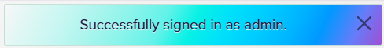

**Logged out (success)**

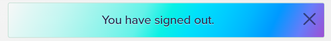

</details>

---

## ♿ Accessibility

- Landmarks for nav/main/footer
- Link names are descriptive (no “click here”)
- Images include `alt` text; decorative images `alt=""`

**Lighthouse Results can be found in the:**[TESTING.md](/TESTING.md)

## 🚀 Performance

- Compressed images in `/static/images` (e.g., WebP)
- Lazy‑load non‑critical images where appropriate
- Minimal external blocking assets; Bootstrap via CDN

---

## 🔐 Security

- `DEBUG = False` in production
- `ALLOWED_HOSTS` configured for Heroku app
- Secret settings via environment (no secrets in Git)
- Django CSRF and session defaults retained

---

## 🛠️ Technologies

**Languages**: Python, HTML, CSS
**Frameworks**: Django, Bootstrap 5
**Database**: SQLite (dev), Postgres (prod optional)
**Hosting**: Heroku + WhiteNoise (static files)
**Tooling**: VSCode, Git & GitHub, Chrome DevTools

Key packages (pin to your versions in `requirements.txt`):

- `Django`
- `gunicorn`
- `whitenoise`
- `psycopg2-binary` (if Postgres)

---

## 💻 Local Development

### Prerequisites

- Python 3.x, Git, VSCode

### Quickstart

```bash
# 1) Clone
git clone <your-repo-url>
cd <project-folder>

# 2) Create & activate venv
python -m venv .venv
# VSCode: use Command Palette → Python: Select Interpreter → .venv
source .venv/bin/activate  # (Windows Bash: source .venv/Scripts/activate)

# 3) Install
pip install -r requirements.txt

# 4) Environment
cp .env.example .env  # set SECRET_KEY, DEBUG, etc.

# 5) Migrate & run
python manage.py migrate
python manage.py runserver
```

### Using Bootstrap in Django

- Add the CDN `<link>` in `base.html` head
- Use grid/utility classes in templates
- Override styles in `static/css/styles.css`

### Helpful VSCode Tips

- Integrated terminal (Bash) for Git & Django commands
- Black/flake8 linters, Django extension, Emmet for HTML

### Git/GitHub Workflow

- Feature branches per issue: `git checkout -b feat/timetable-view`
- Conventional Commits (e.g., `feat(template): add timetable grid`)
- Pull Requests with linked Issues for traceability

---

## 🧪 Testing

- Automated: model tests for choices/labels; view tests for status codes and templates; URL resolver tests
- Manual: UX walkthroughs across devices; form validation messages; navigation flows
- Validators: HTML (W3C), CSS (Jigsaw), Python (pep8/flake8)

> 🔎 **Testing, Validation & Accessibility**
> Full testing notes (HTML/CSS validators, Python linting, Lighthouse/a11y checks) are documented separately here: [TESTING.md](TESTING.md).

[Back to top ⬆️](#-lux-fitness-gym)

---

## 🐞 Bugs & Fixes

Documented issues with clear **symptom → cause → fix**.

### 2025‑09‑21 — Teacher field displayed index numbers

- **Symptom:** Timetable showed `teacher` as numeric indexes; `get_teacher_display` failed.
- **Cause:** Column stored as **text** while model used `IntegerField(choices)`.
- **Fix:** Reset `ScheduledClass` seed data → migration to cast `teacher` to integer (`ALTER COLUMN ... USING teacher::integer`).
- **Commits:**

  - `chore(data): reset ScheduledClass table for clean seed`
  - `fix(model): cast teacher to IntegerField`

(Keep adding any new bugs here.)

---

## 🚢 Deployment

### ☁️ Heroku Deployment

1. **Create app** in Heroku dashboard.
2. **Config Vars:** `SECRET_KEY`, (optional) `DATABASE_URL` for Postgres.
3. **Procfile:** `web: gunicorn <project_name>.wsgi`
4. **settings.py:**

   - `DEBUG = False` (prod)
   - `ALLOWED_HOSTS = ["<your-app>.herokuapp.com", "localhost"]`
   - Static files: `whitenoise.middleware.WhiteNoiseMiddleware` and `STATIC_ROOT = BASE_DIR / "staticfiles"`

5. **Static collection:** remove `DISABLE_COLLECTSTATIC` then deploy.
6. **Deployment method:** Connect GitHub repo → Deploy branch.

### 🍴 Forking & Cloning

- **Fork:** GitHub → Fork button
- **Clone:** `git clone <fork-url>`

---

## 🙏 Credits

- **Docs:** Django, Bootstrap, Heroku, GitHub, VSCode
- **Images:** Stock images for gym classes (e.g., Yoga, Pilates, Spin, HIIT, Zumba). Ensure licenses permit use and credit where required.

## 🏅 Acknowledgements

- Code Institute community, mentors, and tutors.

---

[Back to top ⬆️](#-lux-fitness-gym)
