# Lux Fitness Gym – TESTING

Manual testing across validators, browsers, devices, and user stories.
No automated test suite was implemented in this release, though Django makes it possible for future iterations.

## 📚 Table of Contents

 
<strong>👈 Click to expand the table of contents</strong>

- [🧾 Code Validation](#-code-validation)

  - [🌐 HTML](#-html)

  - [🎨 CSS](#-css)

  - [🐍 Python](#-python)

  - [💡 Lighthouse](#-lighthouse)

  - [📱 Responsiveness](#-responsiveness)

  - [🌍 Browser Compatibility](#-browser-compatibility)

  - [👥 User Story Testing](#-user-story-testing)

---

## 🧾 Code Validation

### 🌐 HTML

HTML validated using W3C Validator
. Each template’s source code was pasted into the checker.

 
<strong>HTML validation screenshots (click to expand)</strong>

**Home Page**

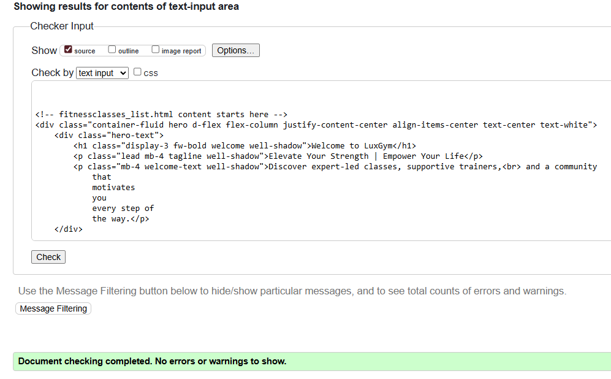

**Class Detail**

**Timetable**

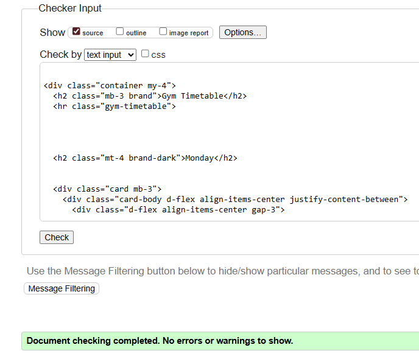

**Admin Dashboard**
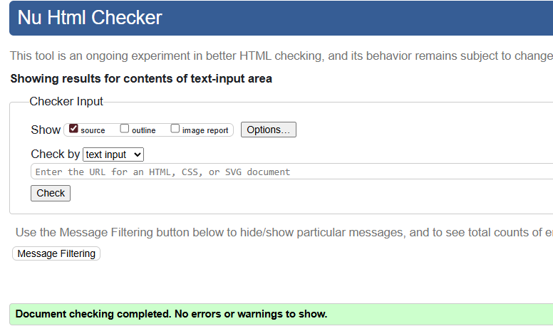

[Back to top ⬆️](#-lux-fitness-gym)

---

### 🎨 CSS

CSS tested using Jigsaw CSS Validator
.

 
<strong>Validation result (click to expand)</strong>

**styles.css**

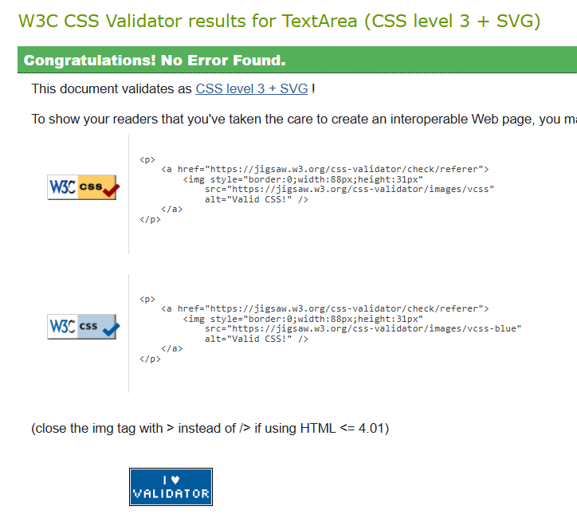

[Back to top ⬆️](#-lux-fitness-gym)

---

### 🐍 Python

Python code tested with PEP8 CI Linter

| App / Module     | Files checked                       | Result / Notes                                          |
| ---------------- | ----------------------------------- | ------------------------------------------------------- |
| **luxclasses**   | `models.py`, `views.py`             | ✔️ All clear                                            |
| **gymtimetable** | `models.py`, `forms.py`, `views.py` | ✔️ All clear                                            |
| **project**      | `settings.py`, `urls.py`            | ⚠️ Minor long-line warnings (Django defaults, modified) |

 
<strong>Validation screenshots for apps (click to expand)</strong>

**App Luxclasses - Model**
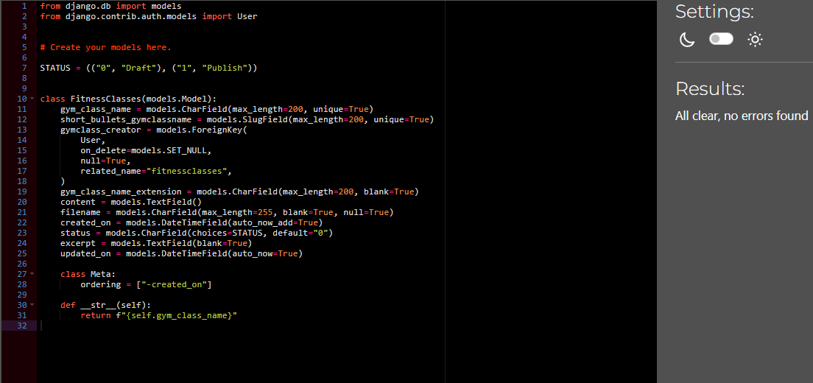

**App Luxclasses - View**

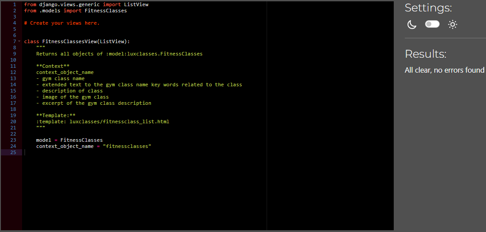

**App Gymtimetable - Model**

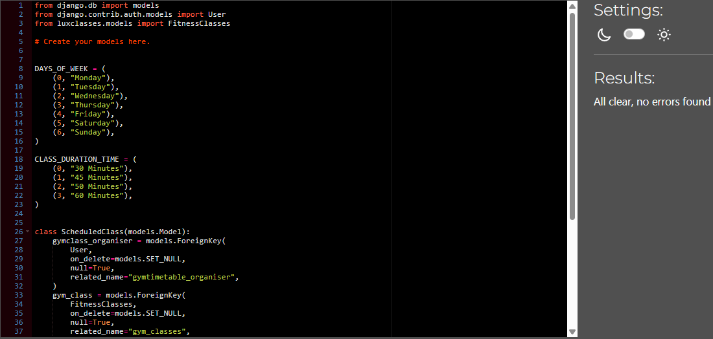

**App Gymtimetable - View**

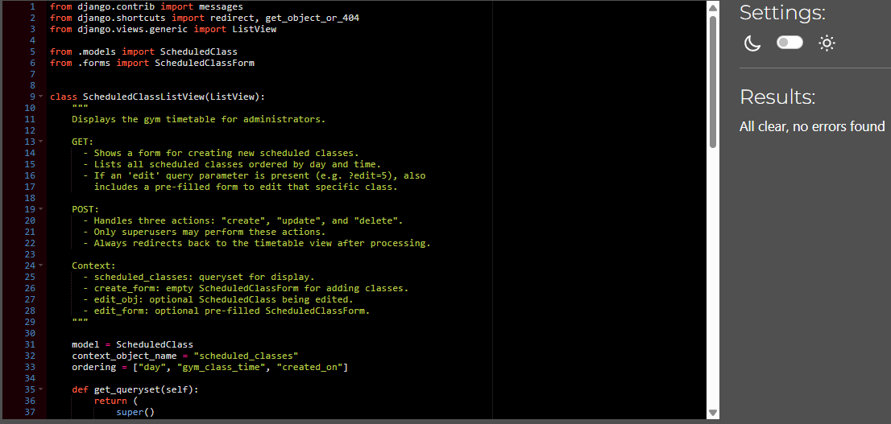

[Back to top ⬆️](#-lux-fitness-gym)

---

### 💡 Lighthouse

Lighthouse
used in Chrome DevTools (Incognito). Audited Performance, Accessibility, Best Practices, and SEO.

Home Page
Mobile & Desktop → Passed ✅

Class Detail
Mobile & Desktop → Passed ✅

Timetable
Mobile & Desktop → Passed ✅

Admin Dashboard
Mobile & Desktop → Passed ✅

 
<strong>Lighthouse results (click to expand)</strong>

##### Home Page

**Mobile Home Page**

**Desktop Home Page**
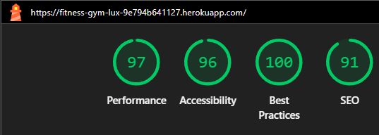

##### Detail Class

**Mobile Detail Class Page**

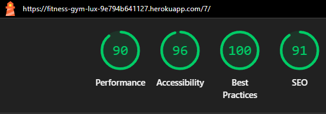

**Desktop Detail Class Page**

##### Timetable

**Mobile Timetable Page**

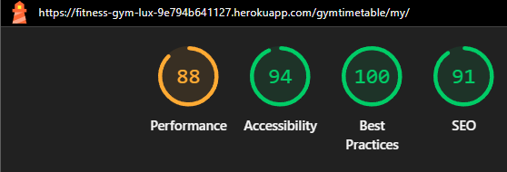

**Desktop Timetable Page**

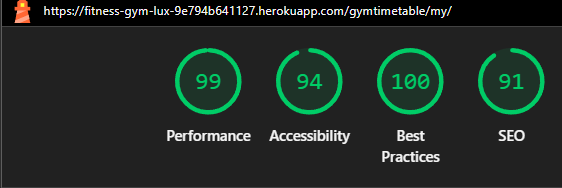

##### Admin Dashboard

**Mobile Admin Page**

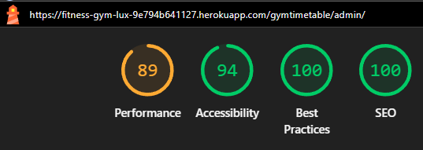

**Desktop Admin Page**

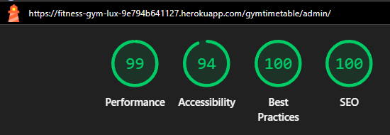

[Back to top ⬆️](#-lux-fitness-gym)

---

## 📱 Responsiveness

Tested from 320px → 1440px using Chrome DevTools and Am I Responsive
.

Additional live testing done on iPhone, Mac Book Pro, and PC devices.

[Back to top ⬆️](#-lux-fitness-gym)

---

### 🌍 Browser Compatibility

Checked on latest versions of Chrome, Firefox, Edge, and Safari (Macbook Pro).

| Browser                  | Appearance | Responsiveness |
| ------------------------ | ---------- | -------------- |
| **Chrome**               | ✅ Good    | ✅ Good        |
| **Firefox**              | ✅ Good    | ✅ Good        |
| **Edge**                 | ✅ Good    | ✅ Good        |
| **Safari (MacBook Pro)** | ✅ Good    | ✅ Good        |

 
<strong>Results table (click to expand)</strong>

**Chrome**

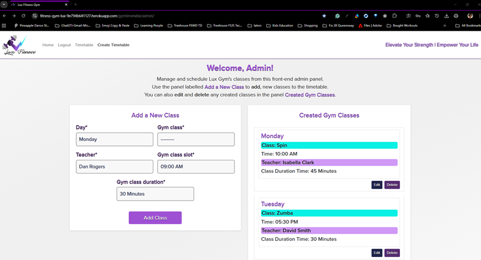

**Firefox**

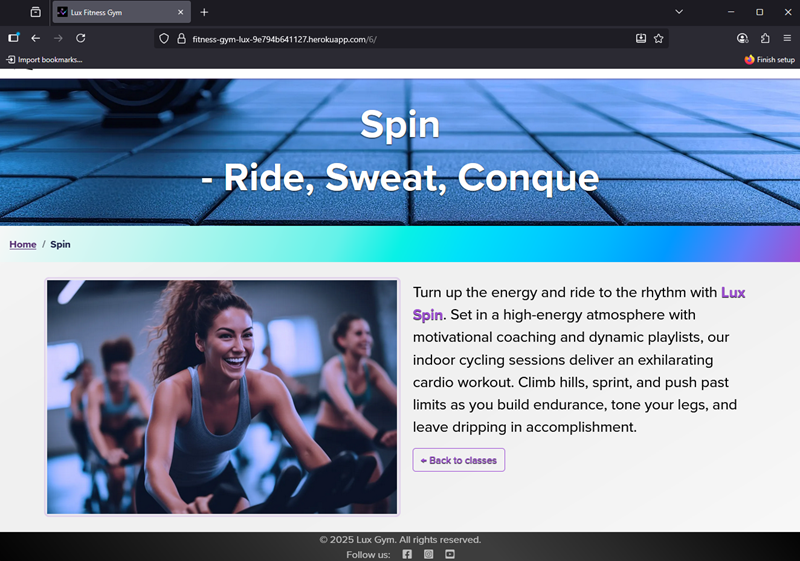

**Edge**

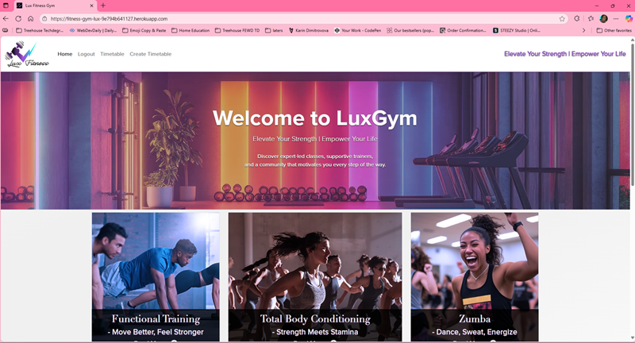

[Back to top ⬆️](#-lux-fitness-gym)

---

### 👥 User Story Testing

Each GitHub Issue / User Story was tested manually. Results are summarised in scenario tables.

#### 🧭 Navbar

| Scenario           | Expected                         | Result  |
| ------------------ | -------------------------------- | ------- |
| Click on Logo      | Navigate to Home                 | ✅ Pass |
| Click on Timetable | Navigate to Timetable            | ✅ Pass |
| Click on Logout    | Log out & show success message   | ✅ Pass |
| Logged-out Navbar  | Show Login / Register links only | ✅ Pass |

#### 📄 Class Detail Page

| Scenario          | Expected                 | Result  |
| ----------------- | ------------------------ | ------- |
| Click “Back” link | Return to Class list     | ✅ Pass |
| Breadcrumb click  | Navigate via breadcrumbs | ✅ Pass |

#### 🗓️ Timetable

| Scenario            | Expected                                | Result  |
| ------------------- | --------------------------------------- | ------- |
| Filter by Monday    | Only Monday classes shown               | ✅ Pass |
| Filter by Wednesday | Only Wednesday classes shown            | ✅ Pass |
| Teacher displayed   | Correct teacher name, not numeric index | ✅ Pass |

#### 🔐 Authentication

| Scenario            | Expected                                 | Result  |
| ------------------- | ---------------------------------------- | ------- |
| Register valid user | Account created, redirected, success msg | ✅ Pass |
| Login valid user    | Redirect to homepage, alert shown        | ✅ Pass |
| Logout              | Session cleared, alert shown             | ✅ Pass |
| Invalid credentials | Show error message                       | ✅ Pass |

#### 🛠️ Admin Dashboard

| Scenario                | Expected                           | Result  |
| ----------------------- | ---------------------------------- | ------- |
| Add new class           | Class added, success alert         | ✅ Pass |
| Update class            | Class updated, success alert       | ✅ Pass |
| Delete class            | Class removed, success alert       | ✅ Pass |
| Non-staff access denied | Redirect to login / permission msg | ✅ Pass |

---

🔙 [Back To README](./README.md) **|** [Back to top ⬆️](#-lux-fitness-gym)
